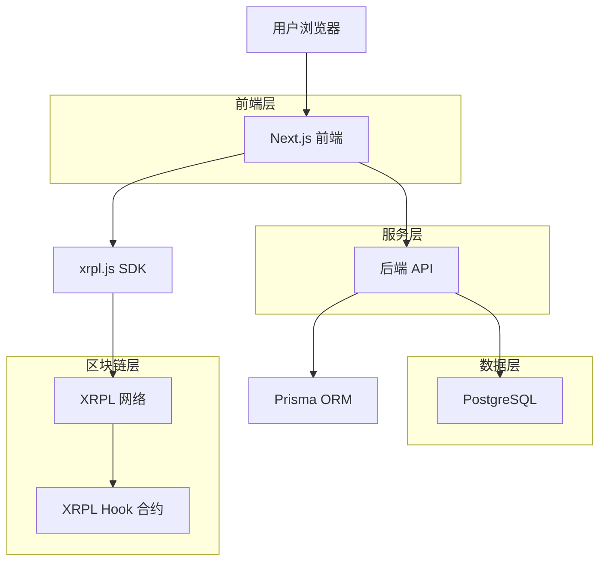
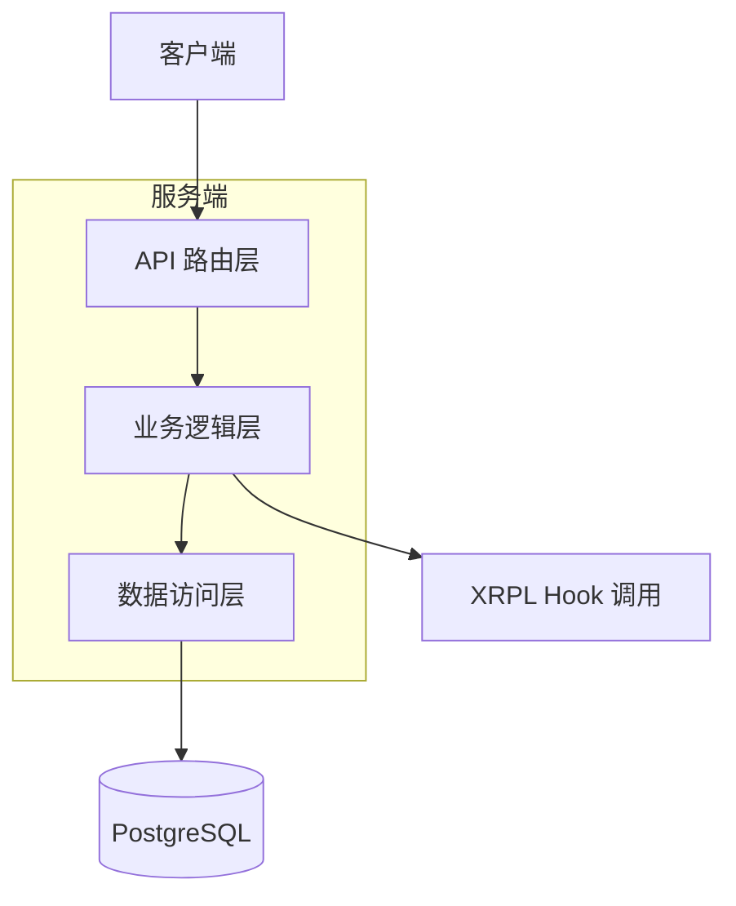
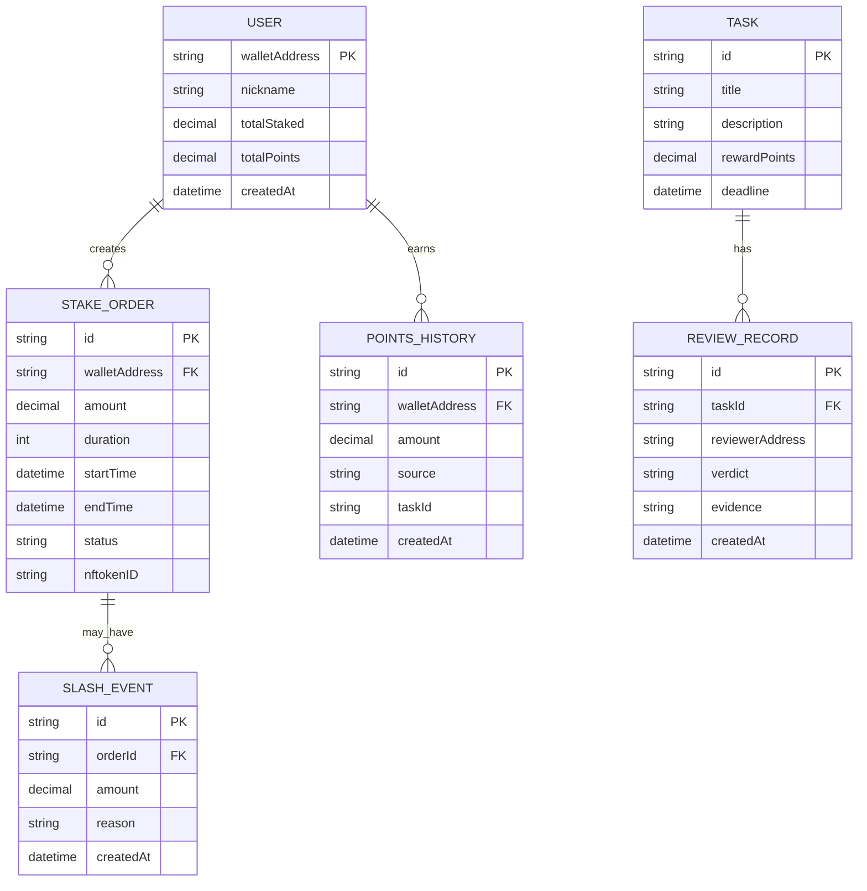

## 1. Architecture design



## 2. Technology Description

* 前端: Next.js\@14 + TypeScript + TailwindCSS + xrpl.js

* 后端: Next.js API Routes + Prisma + PostgreSQL

* 区块链: XRPL Hook (C++) + NFToken

* 初始化工具: create-next-app

* 部署: Vercel + Supabase

## 3. Route definitions

| Route        | Purpose |
| ------------ | ------- |
| /            | 仪表盘首页   |
| /stake       | 质押操作页面  |
| /tasks       | 任务提交与管理 |
| /admin       | 管理员面板   |
| /api/stake   | 质押交易提交  |
| /api/unstake | 解锁本金    |
| /api/slash   | 执行惩罚    |
| /api/points  | 查询积分余额  |
| /api/review  | 任务评审接口  |

## 4. API definitions

### 4.1 质押相关

```
POST /api/stake
```

Request:

| 参数名           | 类型     | 必填   | 描述            |
| ------------- | ------ | ---- | ------------- |
| amount        | number | true | 质押XRP数量       |
| duration      | number | true | 锁仓天数(7/30/90) |
| walletAddress | string | true | 钱包地址          |

Response:

| 参数名       | 类型      | 描述       |
| --------- | ------- | -------- |
| success   | boolean | 操作状态     |
| txHash    | string  | 交易哈希     |
| nftokenID | string  | 积分NFT ID |

示例:

```json
{
  "amount": 1000,
  "duration": 30,
  "walletAddress": "rN7n7otQD9VcF7mqM7fQ8b..."
}
```

### 4.2 任务评审

```
POST /api/review
```

Request:

| 参数名      | 类型     | 必填    | 描述                      |
| -------- | ------ | ----- | ----------------------- |
| taskId   | string | true  | 任务ID                    |
| verdict  | string | true  | 裁决结果(pass/reject/slash) |
| points   | number | false | 积分奖励数量                  |
| evidence | array  | true  | 证据列表                    |

## 5. Server architecture diagram



## 6. Data model

### 6.1 数据模型定义



### 6.2 数据定义语言

用户表(users)

```sql
CREATE TABLE users (
  wallet_address VARCHAR(35) PRIMARY KEY,
  nickname VARCHAR(50) NOT NULL,
  total_staked DECIMAL(15,6) DEFAULT 0,
  total_points DECIMAL(15,6) DEFAULT 0,
  created_at TIMESTAMP DEFAULT NOW()
);
```

质押订单表(stake\_orders)

```sql
CREATE TABLE stake_orders (
  id UUID PRIMARY KEY DEFAULT gen_random_uuid(),
  wallet_address VARCHAR(35) REFERENCES users(wallet_address),
  amount DECIMAL(15,6) NOT NULL,
  duration INTEGER NOT NULL CHECK (duration IN (7,30,90)),
  start_time TIMESTAMP DEFAULT NOW(),
  end_time TIMESTAMP NOT NULL,
  status VARCHAR(20) DEFAULT 'active' CHECK (status IN ('active','completed','slashed')),
  nftoken_id VARCHAR(64) UNIQUE,
  created_at TIMESTAMP DEFAULT NOW()
);

CREATE INDEX idx_stake_orders_wallet ON stake_orders(wallet_address);
CREATE INDEX idx_stake_orders_status ON stake_orders(status);
```

积分历史表(points\_history)

```sql
CREATE TABLE points_history (
  id UUID PRIMARY KEY DEFAULT gen_random_uuid(),
  wallet_address VARCHAR(35) REFERENCES users(wallet_address),
  amount DECIMAL(15,6) NOT NULL,
  source VARCHAR(50) NOT NULL,
  task_id VARCHAR(64),
  created_at TIMESTAMP DEFAULT NOW()
);

CREATE INDEX idx_points_wallet ON points_history(wallet_address);
CREATE INDEX idx_points_created ON points_history(created_at DESC);
```

