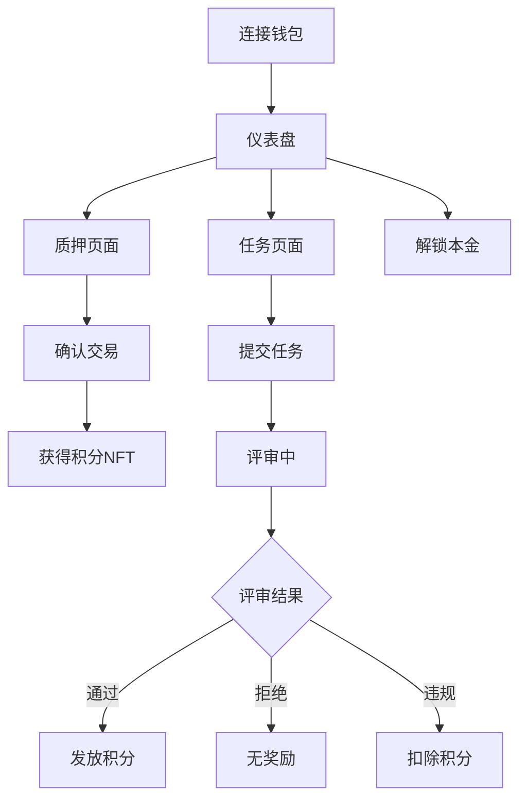

## 1. Product Overview
基于 XRPL 的去中心化质押协议，用户锁仓 XRP 获得不可转让积分奖励，违规将被惩罚，到期可解锁本金。为黑客松参与者提供透明的任务评审与经济激励机制。

## 2. Core Features

### 2.1 User Roles
| Role | Registration Method | Core Permissions |
|------|---------------------|------------------|
| 参与者 | 钱包连接(XRPL) | 质押/解锁、查看积分、提交任务 |
| 评审员 | 系统授权 | 审核任务、执行惩罚、发放积分 |
| 管理员 | 系统初始化 | 设置参数、紧急暂停、升级合约 |

### 2.2 Feature Module
核心页面：
1. **仪表盘**: 质押概览、积分余额、任务列表、快速操作
2. **质押页**: 输入金额、选择期限、确认质押、查看收益预估
3. **任务页**: 提交任务、上传证据、查看评审进度、历史记录
4. **管理页**: 参数配置、评审面板、紧急控制、数据导出

### 2.3 Page Details
| Page Name | Module Name | Feature description |
|-----------|-------------|---------------------|
| 仪表盘 | 概览卡片 | 显示当前质押总额、累计积分、可用余额 |
| 仪表盘 | 质押操作 | 快速质押入口、输入金额滑块、期限选择器 |
| 仪表盘 | 积分明细 | 展示获得/扣除记录、来源任务、时间戳 |
| 质押页 | 质押表单 | 输入XRP数量、选择锁仓周期(7/30/90天) |
| 质押页 | 确认面板 | 显示预估收益、风险提醒、交易签名 |
| 质押页 | 结果反馈 | 展示交易哈希、质押凭证NFT、状态跟踪 |
| 任务页 | 任务提交 | 填写任务ID、上传证据文件、提交申请 |
| 任务页 | 进度跟踪 | 查看评审状态、预计完成时间、历史记录 |
| 管理页 | 评审面板 | 查看待审任务、执行通过/拒绝/惩罚操作 |
| 管理页 | 参数设置 | 调整最小质押额、惩罚比例、积分汇率 |

## 3. Core Process
### 参与者流程
连接钱包 → 质押XRP → 获得积分NFT → 提交任务 → 等待评审 → 查看结果

### 评审员流程
登录管理 → 查看待审任务 → 验证证据 → 做出裁决 → 发放/扣除积分

## 4. User Interface Design
### 4.1 Design Style
- 主色：#0F172A(深蓝灰) + #10B981(绿色)
- 辅色：#EF4444(红色警示) + #F59E0B(橙色)
- 按钮：圆角矩形，主要操作绿色填充
- 字体：Inter 系列，标题 24-32px，正文 14-16px
- 布局：卡片式网格，左侧导航，右侧内容
- 图标：Heroicons 线性风格

### 4.2 Page Design Overview
| Page Name | Module Name | UI Elements |
|-----------|-------------|-------------|
| 仪表盘 | 顶部统计 | 四列卡片展示质押总额、积分余额、任务完成率、收益率 |
| 仪表盘 | 质押卡片 | 中心位置大卡片，包含金额输入滑块、期限选择按钮 |
| 质押页 | 表单区域 | 左侧输入区(金额、期限)，右侧实时预览收益 |
| 任务页 | 提交表单 | 顶部任务选择器，中部文件上传区，底部提交按钮 |
| 管理页 | 评审表格 | 数据表格展示任务列表，操作按钮组 |

### 4.3 Responsiveness
桌面优先设计，适配 1280px 以上屏幕，移动端响应式布局，支持触摸操作优化。